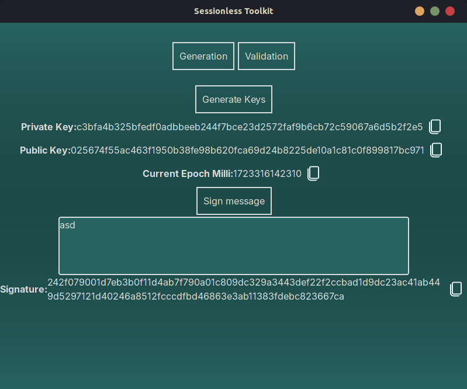
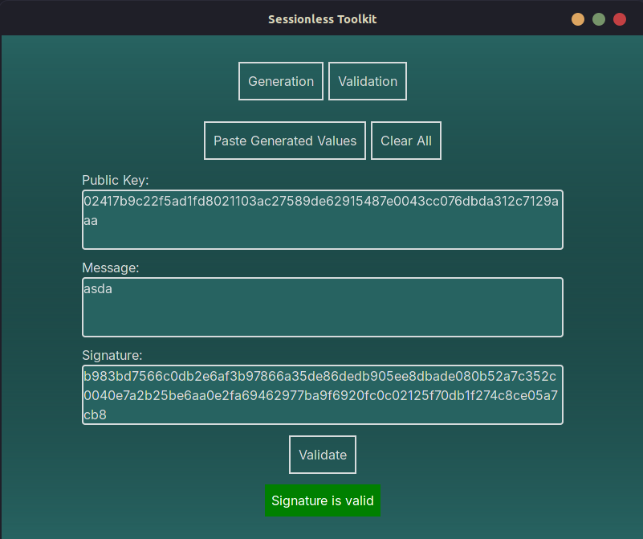

This is a [Next.js](https://nextjs.org/) project bootstrapped with [`create-next-app`](https://github.com/vercel/next.js/tree/canary/packages/create-next-app).

## Getting Started

To deploy this application code run:

```bash
cargo tarui dev
```

To build as desktop native run:

```bash
cargo tauri build
```

See releases for windows/mac/linux packages

The Generator Tab allows for quick generation of keys and signature.


The Validator Tab allows for validation of PublicKey + Message + Signature

You can also Paste over the information from the Generator Tab to quickly assess generated data.
